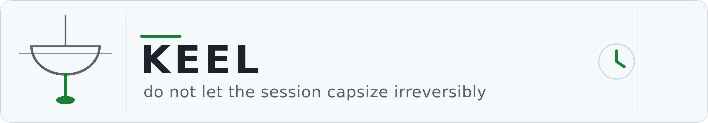

# Keel

<picture>
  <source media="(prefers-color-scheme: dark)" srcset="docs/img/keel-hero-dark.png">
  
</picture>

**One purpose: do not let the session capsize irreversibly.**

Shipped plugin — installable and versioned. The dispatcher is replay-tested against authored sessions; its effect on a live session's outcome is unmeasured.

*Formerly Gyroscope; renamed at v2.0.0, when the positive half merged in. The mechanism is
unchanged — GitHub redirects the old repository name.*

The drift it opposes is the one where the DEFAULT is the unhealing issue. Not where an act
is dangerous, not where something ends badly — where *doing nothing* lands you somewhere that
does not heal. `rm -rf build/` is a moment; the state it leaves is one where the evidence of what
was there is gone, and you cannot correct what you cannot reconstruct. The worst of it is when
the correct path is unreachable without reversing the default — a green check is the pure case:
greenness is what ends the run, so investigating requires first reversing "it's green."

## How it heals: reversal

Keel reverses that default. Where the session would otherwise capsize — the costly act just
runs, the cheap guard is forgotten — it makes denial the resting state, so what happens when
nobody acts is the safe fate instead of the unhealing one. The method is a repricing, not a
prohibition:

| | the costly call | the guard |
|---|---|---|
| before | free — it just runs | takes effort, and is forgotten |
| after | costs one cheap call on record | free — denial is the resting state |

Same object, two reachable fates, the cost assignment swapped, nothing added. Forgetting now
produces the safe outcome, so the rule is not defeated by ordinary forgetting, and its failure
mode is loud rather than silent: the thing you wanted requires an artifact that is either there
or is not.

The repricing buys one session at a time. The pages shipped beside the clause table carry the
other half: for each denied moment, the authored **construction** that makes the guard's outcome
a property of the path — so on a path built right, the deny stops firing at all, wherever the
construction's own effect is one Keel observes (two are not, and say so: C08 and U25). Every clause row
anchors its construction, and the fence refuses a pairing that does not resolve.

## Why a keel

A session is a flow — the default toward *proceed, it looks complete, keep going* reasserts at
every turn, not once at entry, so one instruction at the entrance is spent by turn three. What
holds a hull against standing pressure is a keel: built once, below the waterline, permanently
there. It needs no spin, no attention and no trigger — being present is its whole job, which is
why this is a hook registered on every event rather than something that runs at session start.
With the same wind, a keel keeps the hull from being capsized or shoved
sideways — the deny half — and it is what makes sailing *toward* something possible at all: the
same pressure that would only push the boat off course becomes headway — the construction half,
where the default that used to cost you is turned into the thing that carries the work forward.
It does not choose the course; it makes the course you set holdable. The ledger is the ballast
bolted along it: the stored state that keeps the keel biting across turns, so each turn inherits
the opposition instead of re-earning it.

## The mechanism

<picture>
  <source media="(prefers-color-scheme: dark)" srcset="docs/img/ledger-flow-dark.png">
  
</picture>

A `PreToolUse` deny records a **demand**; a later call matching the clause's guard records a
<!-- BEGIN GENERATED: stop-ledger-read | source: plugin/keel/clauses.json | regenerate: python3 tools/render_views.py --write -->

**discharge**; at `Stop` anything still open blocks. That is the whole model — every
one of the 24 clause demands is read at Stop by one mechanism
([`keel/ledger.py`](plugin/keel/ledger.py) states this where the mechanism is defined).

<!-- END GENERATED: stop-ledger-read -->
A licence is an **observed discharge**, never an absent demand — the absence of evidence is never
treated as permission.

<!-- BEGIN GENERATED: demand-moments | source: plugin/keel/clauses.json | regenerate: python3 tools/render_views.py --write -->

A demand is not always raisable before the act it names. Of the 24 clauses, only
3 can deny the costly call itself on its way in; the rest are read at a moment the
clause's own occasion fixes, and an effect occasion cannot be read until the act has
happened, so its demand refuses the *next* act rather than this one:

| The demand is raised | Clauses | Because the occasion is |
| --- | --- | --- |
| before the act | 3 | a closed host `tool_name` enum, read on `PreToolUse` |
| at the session's first act | 3 | `always`, read on `PreToolUse` |
| after the act, from what it did | 14 | an observed effect, read on `PostToolUse` |
| at the ending | 4 | `always`, read at `Stop` |

<!-- END GENERATED: demand-moments -->

The ledger's properties, each stated in the code it constrains:

- **Obligations are un-windowed within a session.** A promise does not expire because an hour
  passed; events may be windowed for cost, demands never are.
- **Absence is not a pass.** An empty ledger at Stop means nothing was recorded, which is not the
  same as nothing being owed — it is NOT-EVALUABLE. A shipped verifier once scored an *absent*
  check better than an empty one, and that inversion is the defect the ledger refuses to repeat:
  with the clause directory emptied, `rm -rf build/` was ALLOWED and Stop returned `{}` — a clean
  bill of health from a gate that checked nothing — so a zero-clause load now blocks Stop rather
  than passing it.
- **The hash chain is read once per session, at SessionStart, and it is advisory.** Every ledger
  row carries the hash of the row before it, computed as the row is appended.
  `dispatch.session_start` calls `Ledger.verify_chain`, which re-derives that chain and names the
  first divergent hash; a divergence is written to the journal as a `chain_divergent` fault and
  **does not block** (`failed_closed=False`) — a session must not be stopped by a corruption check
  on its own log. The call sits deliberately **before** compaction, because compaction rewrites
  every kept row's `prev` and `hash`, so a divergence compaction is about to erase must be read
  first or it is destroyed unread.
  What that buys, and what it does not: the check runs **once, at the start**, so corruption
  introduced *during* a session is not noticed until the next one begins. What a verification
  catches is accidental corruption, a truncated write, bit-rot — an altered row, a broken or
  missing hash. What it does not catch is **the deletion of a valid tail** (a shorter chain
  re-derives cleanly) and **forgery** — the ledger is written by the same agent it constrains, so
  anyone who can append a row can append its matching hash. No mechanism inside this trust
  boundary can do better than that last one.
- **A measured scoping limit (2026-08-14, observed, not theorised).** A nested `claude -p`
  invocation reported the SAME `session_id` as the session that launched it, with `agent_id`
  empty. Scope is keyed on `(session_id, agent_id)`, so a nested run shares its parent's ledger
  and the parent can be blocked at Stop by a demand the child raised. The keying is correct for
  the ids the host supplies — it cannot separate threads the host does not distinguish. Recorded
  rather than papered over, because a scope that silently pools is worse than one that says it
  pools.

`plugin/` is the whole package — exactly what the marketplace installs:

<!-- BEGIN GENERATED: package-clause-count | source: plugin/keel/clauses.json | regenerate: python3 tools/render_views.py --write -->

- **the dispatcher** (`keel/`) and the shipped clause table (`keel/clauses.json`,
  24 admitted clauses), the POSIX shim (`hooks/dispatch.sh`), and hook manifests for both
  supported hosts. Every fingerprint is an exact predicate over command, tool, or path identity
  — no clause infers intent from prose. The hook fails open: if the dispatcher cannot run, it
  stays silent rather than blocking the host.

<!-- END GENERATED: package-clause-count -->
- **one skill** ([`plugin/SKILL.md`](plugin/SKILL.md), with
  [`POINTS.md`](plugin/POINTS.md) and [`ACTS.md`](plugin/ACTS.md) beside it) — the positive
  half. For each denied moment it names the construction that makes the guard unnecessary from
  then on, and for the moments that leave no mark in a call sequence — budgets, plans, defaults,
  reports — the ten acts[^m-act-count] carry the same reading. Each clause row's `construction` field
  anchors into `POINTS.md`, so every negative is followed by its positive as a schema property
  the loader checks, not a cross-document convention.

### Install

- **Claude Code** — `hooks/hooks.json` is already the right shape; the bundle registers via
  `.claude-plugin/plugin.json`. Zero extra action.
- **Codex** — copy `hooks/hooks.codex.json` to the location Codex reads (`.codex/hooks.json` in a
  project).

### The cut

A bare `/compact` asks for a compaction with no preserve list. `UserPromptSubmit` supplies the
vendored one (`plugin/keel/compaction.json`, pinned by a digest of its own bytes) as context the
model acts on; a `/compact` that already carries instructions is left untouched. An automatic
compaction submits no prompt and cannot be instructed — `PreCompact`'s context is documented as
not affecting the cut, and blocking it would wedge a session whose window is already full — so
that path only reports that it ran unsteered.

### Manual bypass

A Bash command whose **leading comment block** carries `# keel-allow:` followed by a reason makes
`PreToolUse` return an empty decision before evaluating any clause:

```
# keel-allow: reviewed with the owner, the build directory is generated
rm -rf build/
```

The scan starts at the first line and stops at the first line that is not blank and not a `#`
comment, so the marker is a header an author types above the command — never something the
command supplies for itself. A marker in a heredoc body, inside a quoted string, in an appended
segment, or on a trailing comment is payload, and payload does not exempt anything. `//` and `--`
are not comment introducers here; the field is a shell command.

`# keel-allow:` is the **only** spelling that exempts a call, and that is a checked claim
rather than a sentence: `tests/test_bypass.py` enumerates every exemption pattern the dispatcher
defines and fails if the set is anything but this one. A second spelling would be a way past all
24 clauses that this page does not name, and an exemption the pages do not name is one nobody can
audit -- a reader counting the ways a call can skip the table would count one and be wrong. A
pre-rename form, `# gyroscope-allow:`, did exactly that and has been removed.

The same header carries a **commitment**, which is not a bypass: `# keel-guard: U20` names an
open demand the call will pay. The call passes, and after it ran its effect record is what pays
— a committed call that paid nothing is recorded as a broken commitment and the demand stays
open. Without the line, a Bash call under an open demand is refused, because before it runs it
cannot be told from the act the demand guards against.

## Honest limitations

Limits before capability claims — read these before the clause table below.

- **The ledger constrains an honest-but-forgetful agent, not a forging one.** Its hash chain is
  re-derivable, and `session_start` re-derives it once per session: that names an altered row or a
  broken or missing hash, still misses the deletion of a valid tail, and is no defence at all
  against a writer able to forge rows, who can recompute hashes anyway. The divergence is recorded
  as a fault, never enforced as a denial.
- **A licence is scoped to `(session, agent, clause, subject)`** — one observed guard licenses
  later matching calls for that clause and that subject, by the same agent in the same session.
  It is session-wide only where the subject itself is session-wide (the empty key); otherwise a
  Read of one file does not pay for the traversal of another.
- **A discharge records what the guard act did, never what it was called.** A guard is a
  host tool call (`Read`, `Grep`, `Glob`, `AskUserQuestion` — the closed `tool_name` enum) or an
  observed **effect** of the guard act. Where a trace exists the effect is a datum checked
  against it — a printed ref the ref snapshot holds, a printed path the worktree snapshot holds,
  printed pids that were alive, a JSON datum that parses — and a mention changes nothing in the
  trace, so it pays nothing. Where no trace exists (`report_pass`, `report_fail`,
  `report_signature`, a warning-free report) the effect is a report shape, and a claim that
  agrees with the shape is accepted: that is the stated bound of a report effect. The loader
  refuses a guard that names a program (`CLAUSE-GUARD-NOMINAL`), with no field to argue an
  exception and no waiver.
- **The first guards are observations of Keel's own measurement.** Before the first act nothing
  agnostic separates a push from anything else (Theorem 3), so `A01`, `A02` and `A03` are paid
  by a host `Read` of `observed.json` (branch, HEAD, dirty paths, the session's processes,
  written before every act and at session start) and of `remote.json` (the remote's heads,
  listed once per session; not written when the remote cannot be listed, so the demand stays
  owed), under Keel's state directory. `Glob` also lists a set for `A02`.
- **A guard that is itself a Bash act passes on a commitment and is checked by its effect.**
  Before it runs, a Bash call cannot be told from the act it would guard, so under an open
  demand it passes only with a leading `# keel-guard: <clause id>` line naming the demand it
  will pay; after it ran, its effect record either paid the demand or did not. A committed call
  that paid nothing is a `broken_commitment` in the journal and the demand stays open, so the
  next act is refused again. Host reads (`Read`, `Grep`, `Glob`) and the non-acts
  (`AskUserQuestion`, `ExitPlanMode`) are never refused by an open demand: neither can be the
  act — a read cannot change the world, and neither `AskUserQuestion` nor `ExitPlanMode`
  changes anything either — and refusing
  a non-act once blocked a refused push behind the very question that would have resolved it.
- **No occasion reads a program's name.** Before the act, the name is the only thing that
  distinguishes one command from another (`proofs/Coverings.v`, Theorem 3), so an occasion that
  read it would miss the same act spelled differently, with its guard removed. Every occasion is
  therefore one of: `always` (three clauses fire on the first act of a session — a call that
  discharges any one of them counts as progress and is not itself refused by the other two, or
  no session could ever begin), a host tool enum, or an **effect** — what the act did to the
  worktree, the refs, the process table, the network or its own output, observed by the hook
  before and after the call (`keel/effects.py`, Theorem 8). An effect occasion is enforced after
  the act: the demand it raises refuses the *next* act until the guard is seen, and the snapshot
  retains the pre-image of anything the act changed or removed. The loader refuses a nominal
  occasion (`CLAUSE-OCCASION-NOMINAL`).
- **An observation is the act's only if it is assigned to it, by one rule.** A process is
  assigned by lineage (the session's tree, its process sessions, or a process session born
  during the act); the host's connection counter has no lineage and is assigned by the idle
  gap — if it moved while no act of this session was running, its movement across the act is
  NOT-EVALUABLE, never the act's. A network effect is any assigned outbound connection, so the
  first `git fetch` of a session raises `U06` and `U24` once; on a host that opens connections
  by itself they are raised once anyway, on an unassignable movement. A process effect is a
  pre-existing process of this session ending during a call; a report effect is a closed set of
  PASS/FAIL/clean datum shapes read off stdout. Each costs at most one interruption per session,
  because a licence is session-scoped. An effect the observer could not measure — no snapshot, no
  repository, `git` timing out — is NOT-EVALUABLE and the occasion is treated as **live**, which
  is the fail-closed reading and what actually runs. NOT-EVALUABLE is not a third outcome an
  operator sees: `clauses.match` says it on the hook's stderr, which reaches the debug log and
  nothing else, and the demand that lands in the ledger carries the clause's ordinary reason.
  So an unmeasured occasion and a measured one are told apart in the log, never on the wire.
- **A network read is a connection this session opened, not a service it reached.** `U06` asks
  for "a read of the network that changes nothing and reports no failure", and all the observer
  has is the host's connection counter: an assigned outbound connection from an act that changed
  no file, moved no ref, left no process and reported no failure. A quiet connect to a closed
  port satisfies that — measured, not theorised — so the effect cannot distinguish an
  authenticated canary from a refused TCP handshake, and it is stated here rather than implied
  away. What it does still refuse is a *mention*: claiming a canary ran pays nothing, because
  either the counter moved during the act or it did not. The limit is recorded beside the effect
  it belongs to in `keel/effects.py` and re-measured by the `net_read_counts_a_closed_port` cell.
- **It does not judge prose.** Every fingerprint is an exact predicate over command, tool, or
  path identity; a clause that would need to infer intent from a command string is not admitted.
- **The denial is verified; the behaviour change is not.** "Prevented" here means exactly one
  thing: a matching costly call is denied before it executes, and that firing is deterministic —
  the corpus replay below proves the dispatcher denies at or before the derailment event in every
  authored fixture. What remains unmeasured is what a live agent does *after* the denial: whether
  it discharges the guard and retries, or routes around it. Built and mechanism-verified is not
  live-model measured; the replay proves where the dispatcher fires, not what an agent does about
  it.

## What Keel writes down

`obligations.jsonl` is a **ledger**, not a log: it records outstanding obligations, so a session in
which every clause passed leaves nothing behind — and so does a session in which the plugin never
ran. "Did Keel catch anything?" therefore had no answer at all. Not "no": *unanswerable*,
which is indistinguishable from never-installed, and which is the same absence-reads-as-green
failure this plugin refuses to accept from a session.

`keel/journal.py` closes that. It appends to `decisions.jsonl` beside the ledger: one
`session` row the first time a session is seen, carrying the loaded **clause count** — a row saying
`clauses: 0`[^m-zero-clauses] is a gate that checked nothing while everyone believes it is on — plus one row per
`deny`, per terminal `block` (including clean reconciliations, which are a positive result a
fires-only log would erase), per `fault`, and per repaired envelope. There is deliberately no row
per allowed call.

Every row names `plugin`, `session_id`, `agent_id` and `tool_name`, and every deny and block on the
wire is now prefixed `keel:`. Plugins on the
[Courthouse bench](https://github.com/Clear-Sights/Courthouse#why-a-courthouse) register
`PreToolUse`, and the host shows the user a reason but never a source.

`fault` rows carry `failed_closed`, which makes Keel's split direction — carriage open,
decision closed — checkable against the record rather than against its docstrings. See
[Courthouse docs/FAIL-DIRECTION.md](https://github.com/Clear-Sights/Courthouse/blob/main/docs/FAIL-DIRECTION.md).

## The shipped clause table

<!-- BEGIN GENERATED: shipped-clause-count | source: plugin/keel/clauses.json | regenerate: python3 tools/render_views.py --write -->

The dispatcher loads `plugin/keel/clauses.json` — 24 admitted clauses, every one carrying
positive and negative fixtures checked at load. The table below is a generated view of that
file, byte-compared against it by the test fence on every push, so it cannot quietly lag the
artifact the dispatcher loads. Each row's construction column anchors the clause's positive
half in [`plugin/POINTS.md`](plugin/POINTS.md).

<!-- END GENERATED: shipped-clause-count -->

<!-- BEGIN GENERATED: clause-routes | source: plugin/keel/clauses.json | regenerate: python3 tools/render_views.py --write -->

| ID | Costly fate | Guard | Construction |
| --- | --- | --- | --- |
| `A01` | push without knowing what is staged or which branch is current | Read Keel's worktree measurement, `observed.json` under Keel's state directory (`$KEEL_STATE_DIR`, default `~/.claude/keel_state`): the branch, HEAD and dirty paths Keel measured before the act | [POINTS.md#a01](plugin/POINTS.md#a01) |
| `A02` | delete a set whose members were never listed, so the loss leaves no record of what it was | list the set first: the host Glob tool, an act whose output names paths the worktree holds, or Read Keel's `observed.json` under Keel's state directory (`$KEEL_STATE_DIR`, default `~/.claude/keel_state`), which carries the measured paths | [POINTS.md#a02](plugin/POINTS.md#a02) |
| `A03` | overwrite remote history that was never read, discarding commits with no local copy | see the remote tips first: Read Keel's `remote.json` under Keel's state directory (`$KEEL_STATE_DIR`, default `~/.claude/keel_state`); Keel lists the remote once per session and writes it there, and writes nothing when the remote cannot be listed | [POINTS.md#a03](plugin/POINTS.md#a03) |
| `C03-verify-what-returns` | end the run by inheriting delegated work without inspecting what came back | read a returned artifact after dispatch and before stopping | [POINTS.md#c03-verify-what-returns](plugin/POINTS.md#c03-verify-what-returns) |
| `C08-check-can-fail` | accepting a checker PASS that has never demonstrated it can reject an invalid or absent input | run this same checker under a planted fault and see it FAIL: a failing report from the checker is the observation | [POINTS.md#c08-check-can-fail](plugin/POINTS.md#c08-check-can-fail) |
| `C09-checker-excludes-self` | count or trust a grep-shaped process match without excluding the observer identity | produce a listing that excludes the observer: the output holds live pids and none of the act's own command text | [POINTS.md#c09-checker-excludes-self](plugin/POINTS.md#c09-checker-excludes-self) |
| `D01` | fan out work with nothing probed first | probe the ground first with a read or a search, so the brief describes what is there | [POINTS.md#d01](plugin/POINTS.md#d01) |
| `P01` | adopt a plan built on nothing read | read something first, so the plan describes this repository and not a remembered one | [POINTS.md#p01](plugin/POINTS.md#p01) |
| `P02` | adopt a plan built on a guessed reading of the request | ask one question about the ambiguity before the plan is fixed | [POINTS.md#p01](plugin/POINTS.md#p01) |
| `T01` | declare the run finished without ever asking the tree whether it is | Read Keel's worktree measurement, `observed.json` under Keel's state directory (`$KEEL_STATE_DIR`, default `~/.claude/keel_state`), at least once this session | [POINTS.md#t01](plugin/POINTS.md#t01) |
| `T02` | end the run treating a push report as a landing | let the ending measure the remote: every remote head that moved this session must equal a local ref (a push that landed); Keel lists the remote itself at Stop | [POINTS.md#t02](plugin/POINTS.md#t02) |
| `U01` | launch a nested worker | run a capability probe of the worker after the launch and see it report PASS -- Keel's own `tools/probe_child_capability.py`, or any probe printing a report | [POINTS.md#u01](plugin/POINTS.md#u01) |
| `U02` | re-launch a nested-worker target | after a failure, change something, then run the target's probe and see it report PASS | [POINTS.md#u02](plugin/POINTS.md#u02) |
| `U03` | use a PID in a signal operation | produce a process listing: an output that holds at least two live pids and the pid that was ended, from whatever program, or Read Keel's `observed.json`, which lists the session's processes -- keyed on the ended pid: a listing that does not name it pays nothing | [POINTS.md#u03](plugin/POINTS.md#u03) |
| `U06` | send a mutating request to an external service | run a read of the network that changes nothing and reports no failure -- an authenticated read canary | [POINTS.md#u06](plugin/POINTS.md#u06) |
| `U08` | create a signed git commit | produce a signature datum: sign something and see the signature block, or verify one | [POINTS.md#u08](plugin/POINTS.md#u08) |
| `U09` | switch or check out a git ref | know the ref: a quiet act that prints the ref name or commit id the ref snapshot holds (`git rev-parse --verify REF`, `git branch`, `git show-ref`, or any listing of refs), or Read Keel's `observed.json`, which carries the refs | [POINTS.md#u09](plugin/POINTS.md#u09) |
| `U10` | traverse structured JSON data | look at the structure first: a query on the same file that prints a non-null JSON datum (`jq 'keys'`, `jq 'type'`, `jq -e 'has(...)'`), or Read the file | [POINTS.md#u10](plugin/POINTS.md#u10) |
| `U12` | apply a patch | look at the changed file itself before applying: Grep or Read it, or print its path from the worktree (`git diff`, `rg`/`grep` -- any quiet act whose output names a path the snapshot holds) -- keyed on each changed path: the look must name that path, and a look at another file pays nothing | [POINTS.md#u12](plugin/POINTS.md#u12) |
| `U13` | apply a generated patch | look at the file the patch changed: Read the target, or print its path from the worktree (`git diff`, `git apply --stat`) -- keyed on each changed path: the look must name that path, and a look at another file pays nothing | [POINTS.md#u13](plugin/POINTS.md#u13) |
| `U19` | perform an in-place text rewrite | look at the rewritten file itself: Grep or Read it, or print its path from the worktree (`git diff`, `cmp`, `rg`/`grep` -- any quiet act whose output names a path the snapshot holds) -- keyed on each changed path: the look must name that path, and a look at another file pays nothing | [POINTS.md#u19](plugin/POINTS.md#u19) |
| `U20` | make a destructive behavior-changing mutation | run an independent behavior observer first: any verifier that prints a report, PASS or FAIL | [POINTS.md#u20](plugin/POINTS.md#u20) |
| `U24` | publish or release an artifact after runtime testing | run the suite so that a warning would have failed it: a passing report with no warning line | [POINTS.md#u24](plugin/POINTS.md#u24) |
| `U25` | run a scanner as an acceptance check | see the scanner find something: run it against its prefix-distractor regression so a report with findings is observed | [POINTS.md#u25](plugin/POINTS.md#u25) |

<!-- END GENERATED: clause-routes -->

One clause[^m-local-tooling-clauses] (`U01`) names Keel's own probe in its guard, and names it as
an example: the guard is discharged by *any* probe that prints a report, so the file is a
convenience the bundle ships and not a requirement — the loader does not refuse a table when it
is absent, and a clause that did require it would be a guard selecting by program name, which the
loader refuses outright (`CLAUSE-GUARD-NOMINAL`). `U01`'s occasion is an effect — a
process that survives the call that launched it — so a repository with no launcher of its own
never triggers it, and one that launches workers under any name does. `U25`'s occasion is a
clean scan report in the call's output, whatever printed it; it is discharged by the observed
effect `report_fail` — *some* act of this session printed a report with findings — and by nothing
else. It is **not** keyed on the command text: this paragraph used to say the discharge required
a command containing `prefix` or `distractor`, and no such condition ships or could. A textual
guard is refused by the loader (`CLAUSE-TEXT-COVERING`, Theorem 1), so the shipped guard is
strictly weaker than that sentence claimed — the observation is "a scanner was seen finding
something", not "the prefix-distractor regression was the thing run".

## Evidence

`python3 eval/replay.py` from the repository root replays recorded sessions through the real
dispatcher — **every clause has a session that drives it**, each denied at or before the event
where the session went wrong, and each required to name the clause it declares rather than
merely to deny, so a session is evidence about its own row and not about the table. 9
sessions[^m-derailments] end at the refusal; 17 continue through the guard and require the same
call to pass afterward; one benign control stays silent — 27/27,[^m-replay] standard library
only, and succeeds iff every session meets its expectation.

One of those sessions is replayed a second time with its authored effect records **stripped**, in
a git repository the replay builds and mutates for real, so the live observer — not the corpus —
has to produce the record the decision is made from. Every clause the recorded run blocks on must
be named by the live run too, or the replay fails. Without it the corpus proved only that the
dispatcher reads records correctly. `dispatch._effect_record` returns immediately when an event
already carries a record, so no authored session ever reaches `effects.delta`: with that function
and both report readings replaced by constant blind values, the corpus replay was green and
exited 0. The live lane is what turns that mutation red (`replay_sees_a_blind_observer`).

A run in which no session produced a denial at all is **NOT-EVALUABLE** (exit 2), never a pass: a
dispatcher whose handlers all return `{}` satisfies the benign control, and a suite whose only
green comes from silence is measuring nothing.

The sessions are generated from `eval/generate_corpus.py` (`--check` is a gate), so every
recorded effect is explicit: a `PostToolUse` event carries the full observation record, and an
absent effect is NOT-EVALUABLE rather than "did not happen". Every session that runs a command
opens with the observations the table owes before any act — a `Read` of `observed.json` and of
`remote.json` — which is the cost of three `always` occasions; a session that opens a connection
then pays the read canary and the warning-free run the connection owes, and the failing run the
PASS then owes, each as a committed Bash act whose record shows the effect. Shown in the corpus
rather than hidden by it.

## The proof, applied to the table

`proofs/Coverings.v` proves, relative to a scanner with two stated properties and with zero
axioms, what each class of covering can be: a covering over the raw command text is never
mention-immune (Theorem 1); one over a segment's leading program is, provided its vocabulary
excludes the quoting program (Theorem 2), and is monotone in that vocabulary (Theorem 5) — which
is why no side of the table is one; a covering over the pipe topology is name-agnostic
(Theorem 4); a positive obligation that compares the run's own datum has an empty evasion set
(Theorem 7); a covering over what the act did reads no segment, so it is name-agnostic and
separates byte-identical commands by their effects (Theorem 8); an ordering enforced backward
rejects every trace the inductive `violates` describes (Theorem 8a). Added for the classes the
loader was already assuming and this file did not state: a disjunction or conjunction of
name-agnostic coverings is name-agnostic (`any_of_name_agnostic`, `all_of_name_agnostic`); a
covering that reads only the host's own `tool_name` field is mention-immune, since a mention
arrives as a Bash call and the host reports the quoting program
(`host_enum_immune`); the `always` covering reads no segment, so renaming changes nothing it
could see (`always_is_name_agnostic`); a composition with a non-vacuous textual disjunct is not
mention-immune, because the disjunct alone already defeats it
(`disj_with_textual_not_mention_immune`); and NOT-EVALUABLE is live — an unmeasured occasion is
treated as fired and an unmeasured guard as unpaid, so no trace with an unmeasured guard is ever
licensed (`unmeasured_occasion_fires`, `unmeasured_guard_never_licenses`).

**Which of these the shipped table actually instantiates, and which are proven only.** All 51
sides of the 24 clauses fall into three classes: `effect` and `composed` (36 sides, Theorem 8
with `any_of_name_agnostic` and `all_of_name_agnostic`), `always` (7 sides, the Theorem 3
boundary) and `tool-enum` (8 sides,
`host_enum_immune`). `tools/check_coq.py` prints exactly that census, so the claim is a build
output, not a paragraph. Everything else here is **proven and instantiated by nothing**:

- **Theorem 4 (topology).** No clause side reads pipe topology or segment count.
- **Theorems 6 and 7 (the positive form).** No side is `positive`. The only code that ever
  produced that class was a `kind: nonzero` predicate with zero shipped uses, which compared one
  field to zero rather than a claimed datum to an observed one — not the Definition the theorems
  are about. It was removed; a `positive` side would need a kind that reads both fields.
- **Theorem 2 (structural mention-immunity).** No code element reads `scan` at all, so no side is
  `structural`; Theorem 2 is what licenses the *refusal* of textual sides, not a side of its own.
- **`ReadsFrom` (closure).** A Definition, deliberately with no theorem: nothing in `Coverings.v`
  separates host, world and datum by proof, and `classify_side` assigning a side to one of them is
  code, not a result.

A proven form with no instance is not a capability. These are listed so the table cannot be read
as covering ground the theory merely describes.

The theory is not cited over the table; it is applied to it. `keel/clauses.py` reads the class of
every side from its shape (`classify_side`) and refuses what the class forbids — a textual side,
a side with no class, an occasion or a guard that selects by program name, an effect the
observer does not measure, and a row carrying `why_no_program`, `guard_vocabulary` or `waiver`.
`tools/render_coverings.py` instantiates the licensed theorems on all 51 sides of the 24 clauses
in the generated `proofs/Clauses.v`; `tools/check_coq.py` compiles both files and grades every
result for axioms, refuses a result proved by the identity, and refuses an instance that covers
fewer sides than the table has. Deleting the proof, letting the instance drift, or adding a row
the theory cannot classify is a red build.

## Why this is not a deny list

[Ward](https://github.com/Clear-Sights/Ward), a sibling plugin, is a deny list: its verdict is a
pure function of one event. For a matching costly call, Keel's decision
is a function of `(event, ledger)`: it is denied before the clause's guard discharge and admitted
afterward. Keel does not substitute a safer action and does not remove a fate — it changes
whether the *same* call executes now or waits until its licensing evidence exists.

## Siblings

Keel is the sequence engine in Courthouse's act/sequence/statement taxonomy; the engines share
nothing else. They install from the [Courthouse](https://github.com/Clear-Sights/Courthouse)
marketplace: `claude plugin marketplace add Clear-Sights/Courthouse`.

| Engine | Judges | One line |
|---|---|---|
| [**Ward**](https://github.com/Clear-Sights/Ward) | the pending **act** | nothing outright bad happens |
| **Keel** (this repo) | the **sequence** | a session neither capsizes nor gets lost |
| [**Makoto**](https://github.com/Clear-Sights/Makoto) | the **statement** | words aren't empty |

## License

Apache-2.0 — see [LICENSE](LICENSE).

[^m-act-count]: The act headings in `plugin/ACTS.md`, counted by the `act-count` command in `MEASURED.tsv`.
[^m-zero-clauses]: A session journal row produced with an empty admitted-clause set, read by the `zero-clauses` command in `MEASURED.tsv`.
[^m-local-tooling-clauses]: Clause rows whose guard or fingerprint names Keel's repository-local tools, counted by the `local-tooling-clauses` command in `MEASURED.tsv`.
[^m-derailments]: Corpus headers with the ordinary firing expectation, counted by the `derailments` command in `MEASURED.tsv`.
[^m-replay]: Passing sessions over corpus sessions, measured by the `replay` command in `MEASURED.tsv`.
